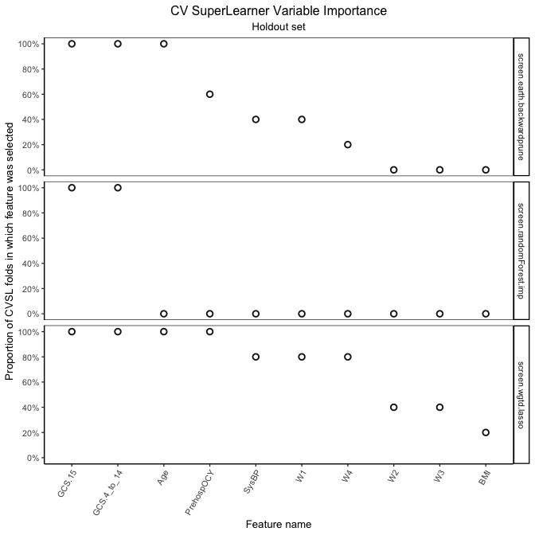
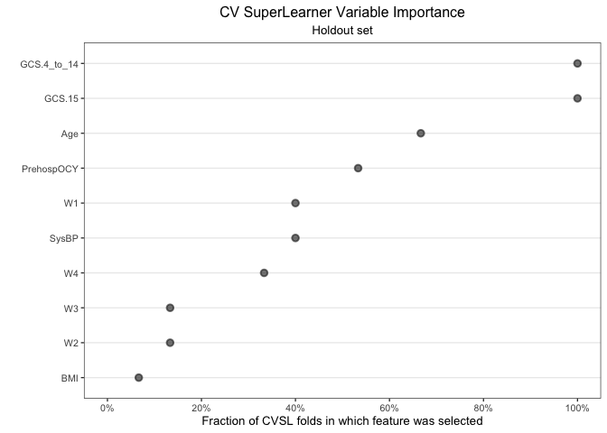
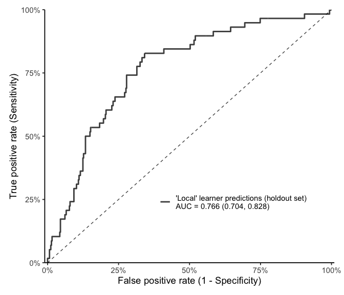

Yet Another Local Learner (YALL)
================================

<!-- badges: start -->

[](https://github.com/saraemoore/yall/actions/workflows/R-CMD-check.yaml)
<!-- badges: end -->

Overview
--------

The `yall` package implements a local learning algorithm, building upon
the ensemble learner Cross-Validated
[SuperLearner](https://github.com/ecpolley/SuperLearner)
(`SuperLearner::CV.SuperLearner()`).

Installation
------------

The `yall` package is currently only available via GitHub. To install:

``` r
remotes::install_github("saraemoore/yall")
```

Examples
--------

``` r
library(yall)
library(SuperSelector)  # sim_proppr_data, factor_to_indicator
library(SuperLearner)   # screening and prediction library algorithm functions
library(FSelector)      # screening library algorithm functions
library(tidyr)          # expand_grid
library(dplyr)          # %>%, slice_min, select, left_join, arrange
library(caret)          # createDataPartition
library(origami)        # make_folds, cross_validate
library(future)         # plan

libraryCVSLFeatSel <- list(
    `lasso mean` = c("SL.mean", "screen.wgtd.lasso"),
    `random forest biggest diff mean` = c("SL.mean", "screen.randomForest.imp"),
    `splines biggest diff mean` = c("SL.mean", "screen.earth.backwardprune"),
    `lasso glm` = c("SL.glm", "screen.wgtd.lasso"),
    `random forest biggest diff glm` = c("SL.glm", "screen.randomForest.imp"),
    `splines biggest diff glm` = c("SL.glm", "screen.earth.backwardprune")
)

libraryMetaFeatSel <- data.frame(selector = c("cutoff.biggest.diff", "cutoff.k", "cutoff.k"),
                                 k = c(NA, 3, 6),
                                 stringsAsFactors = FALSE)
rownames(libraryMetaFeatSel) <- c("biggest diff", "top3", "top6")

libraryNeighborWeights <- tidyr::expand_grid(norm = c("L1", "L2"),
                                             kernel = c("uniform", "tricube"),
                                             window = c(0.15, 0.3)) %>%
                            as.data.frame(stringsAsFactors = FALSE)

librarySimplePred <- list(
  c("SL.glm.mean", "All"),
  c("SL.glm", "screen.corRank3.wgtd"),
  c("SL.glm", "screen.corRank6.wgtd")
)

methodCVSLFeatSel <- c("method.NNloglik")

nCVSLFeatSelFolds <- 5

family <- binomial()

my_seed <- 98765
n_obs <- 2000

set.seed(my_seed)
```

``` r
proppr_sim <- SuperSelector::sim_proppr_data(n_obs = n_obs, rnd_seed = my_seed)

Y_full <- as.numeric(proppr_sim$Y)
X_full <- bind_cols(proppr_sim, as.data.frame(SuperSelector::factor_to_indicator("GCS", proppr_sim)))
X_full <- subset(X_full, select = -c(ID, Y, GCS))

# 75/25 [tuning] vs [holdout] split
valid_prop <- 0.25
holdoutIdx <- caret::createDataPartition(Y_full, times = 1, p = valid_prop)[[1]]
X_holdout <- X_full[holdoutIdx,]
Y_holdout <- Y_full[holdoutIdx]
X_tuning <- X_full[-holdoutIdx,]
Y_tuning <- Y_full[-holdoutIdx]

# within the tuning set, make CV folds
nFolds <- 5
cvFoldInfo <- origami::make_folds(X_tuning, V = nFolds)
```

``` r
plan(sequential)

# expect this function to run for several minutes for this simulated dataset,
#   particularly when executing sequentially
predres <- origami::cross_validate(
  cv_fun = trainYALL,
  folds = cvFoldInfo,
  y_all = Y_tuning,
  x_all = X_tuning,
  family = family,
  cvSLfeatsel_control = list(SL.library = libraryCVSLFeatSel, method = methodCVSLFeatSel,
                             selector.library = libraryMetaFeatSel, nFolds = nCVSLFeatSelFolds),
  neighbor_control = list(library = libraryNeighborWeights),
  predict_control = list(SL.library = librarySimplePred, trimLogit = 0.001),
  save_fit_library = FALSE,
  save_dist = FALSE,
  # cross_validate() uses future by default to process each fold in parallel.
  #   future.packages specifies which packages to attach in the environment within each fold.
  future.packages = c("SLScreenExtra"),
  # .combine_control tells cross_validate() how to combine list elements from each fold's results
  .combine_control = list(combiners = list(predict = combiner_rbind, screen = combiner_rbind,
                          screen_full = combiner_c, screen_which = combiner_rbind))
)
```

``` r
# one row per unique combo of tuning parameter settings
predSummary <- summarizeYALL(predres$predict)
# minimum cvRiskSum (note that there may be ties):
predSummary %>% slice_min(cvRiskSum, with_ties = TRUE) %>% knitr::kable()
```

| norm | kernel  | window | screener             | predictor | combo\_method | selector |   k | cvRiskSum |
|:-----|:--------|-------:|:---------------------|:----------|:--------------|:---------|----:|----------:|
| L2   | uniform |    0.3 | screen.corRank3.wgtd | SL.glm    | NNloglik      | cutoff.k |   6 |  134.8602 |

``` r
# subset predictions to only those with the settings which resulted in the min cvRiskSum
best_res_row <- predSummary %>%
  slice_min(cvRiskSum, with_ties = FALSE) %>%
  select(-cvRiskSum) 
```

``` r
# use the optimal parameters selected using the tuning set to predict outcomes in the holdout set
predall_holdout <- predictAllYALL(newX = X_holdout,
                                  y_all = Y_tuning,
                                  x_all = X_tuning,
                                  family = family,
                                  predSummaryRow = best_res_row,
                                  libraryCVSLFeatSel = libraryCVSLFeatSel,
                                  nCVSLFeatSelFolds = nCVSLFeatSelFolds)
```

``` r
# Holdout set: Global feature selection by screening algorithm
#   (via SuperSelector package)
cvSLVarImpPlot2(summarizeScreen(predall_holdout$screen,
                                groupCols = c("method", "screener")),
                subtitle = "Holdout set",
                y_breaks = seq(from = 0, to = 1, length.out = max(predall_holdout$screen$fold) + 1))
```



``` r
# Holdout set: Global feature selection across all screening algorithms
#   (via SuperSelector package)
cvSLVarImpPlot(summarizeScreen(predall_holdout$screen,
                               groupCols = "method"),
               labelVals = FALSE,
               subtitle = "Holdout set",
               addSummary = FALSE,
               x_breaks = seq(from = 0, to = 1, length.out = max(predall_holdout$screen$fold) + 1))
```



``` r
ll_assessed <- assess_predictions(predall_holdout$predict$library.predict,
                                  Y_holdout,
                                  "'Local' learner predictions (holdout set)")
```

``` r
# Holdout set: Receiver operating characteristic curve

library(ggplot2)

ggplot(data = ll_assessed$roc, aes(x = fpr, y = tpr, color = method)) +
    geom_line(size = 1, alpha = 0.9) +
    geom_segment(data = data.frame(x = 0, y = 0),
        aes(x = x, y = y, xend = x + 1, yend = y + 1),
            color = "black", linetype = 2, alpha = 0.75) +
    scale_x_continuous("False positive rate (1 - Specificity)", limits = c(-0.01, 1.01),
      labels = scales::percent, expand = c(0,0)) +
    scale_y_continuous("True positive rate (Sensitivity)", limits = c(0, 1),
      labels = scales::percent, expand = c(0,0)) +
    scale_color_manual(NULL, values = "grey20") +
    theme_classic(base_size = 14) +
    theme(legend.position = c(0.65, 0.25),
          plot.margin = margin(0.5, 0.5, 0.5, 0.5, "cm"))
```



``` r
# Holdout set: Example Local Regression Model Coefficient Estimates for a single observation

library(gtsummary)
library(kableExtra)

local_mod <- predall_holdout$predict %>%
                bind_cols(y_observed = Y_holdout) %>%
                mutate(resid = abs(y_observed - library.predict)) %>%
                slice_min(resid) %>%
                pull(fitLibrary) %>%
                `[[`(1)

local_coef <- tbl_regression(local_mod, exponentiate = TRUE, intercept = TRUE) %>%
                  modify_column_hide(columns = p.value) %>%
                  modify_column_unhide(columns = std.error)

as_kable_extra(local_coef, format = "pipe")
```

| Characteristic |  OR  |  SE   |   95% CI   |
|:---------------|:----:|:-----:|:----------:|
| (Intercept)    | 0.06 | 0.968 | 0.01, 0.34 |
| GCS.15         | 0.09 | 0.641 | 0.02, 0.30 |
| Age            | 1.07 | 0.029 | 1.01, 1.14 |
| PrehospOCY     | 0.60 | 0.327 | 0.30, 1.09 |
